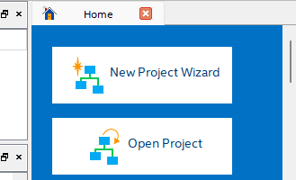
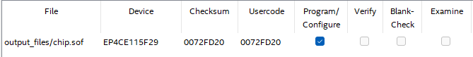
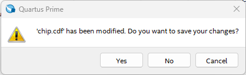
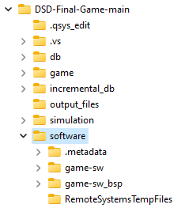
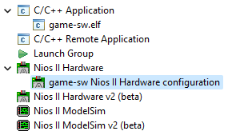
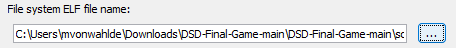

# DSD-Final-Game By Hayato Tsujii, Emmett Crawford, Matthew VonWahlde, Cameron Zhang

This game runs on the Altera DE2-115.

# Objective
1. Avoid the asteroids that come your way!
2. Survive as long as you can!

# Features
1. 10Hz LCD Gameplay
2. 4 Lives indicated on LEDG 0-3
3. Death animation played on death
4. 3 Different asteroid sprites
5. Special 1/16 chance black hole : instant Game Over
6. Randomly generated asteroids
7. Score 0 to 9999 on 7-Segment Display

## How to run on your computer 
- Download ZIP file.
- Unzip the folder by right clicking the ZIP file and selecting "Extract All..."
- Select the source destination and click "Extract."
- Once that is complete, open Quartus Prime 18.0.
- In the home tab, select "Open Project."

- Navigate to the downloaded folder, and double click to enter.
- Open the file .../DSD-Final-Game-main/chip.qpf
- Now, in Quartus, navigate to Tools->Programmer.
- Quartus should identify the chip.sof file automatically.

- If it did not, click "Add File..."
- Open the file .../DSD-Final-Game-main/output_files/chip.sof
- Make sure Altera DE2-115 board is turned on.
- If the Programmer has not identified the target board, click "Hardware Setup..." then double click USB-Blaster. Close that window.
- Click start to upload the custom chip to the FPGA board.
- Sometimes, the upload fails, so click start again if that is the case.
- After the upload is successful, close the programmer.
- A window may pop up. Select Yes to save changes to the chip.cdf file.

- Now, navigate to Tools->Nios II Software Build Tools for Eclipse.
- Once Eclipse is open, it will prompt you to select a workspace.
- Select "Browse...", then select the folder where the projects were extracted .../DSD-Final-Game-main/software. Click "OK" to select that workspace.

 - Click "OK" again to open the workspace.
 - Navigate to Run->Run Configurations... 
 - Expand "Nios II Hardware" on the right and select game-sw Nios II Hardware configuration.

 - Click the "..." in the "File system ELF file name:" section.
 
 - Return to where the files were extracted, from the folder, select ...DSD-Final-Game-main/software/game-sw/game-sw.elf and click "Select."
 - Click "Apply" and then "Run."
 - The executable and linkable format file for the game should now upload to the board.
 - Enjoy the game!
   
## How to play
1. To start game
  - Press Key 2 to start playing
2. Move up and down
  - Use Switch 17 to move the spaceship up and down to avoid the asteroids coming right to left
3. Reset game 
  - To reset the game press Key 0
    
## Troubleshooting in Eclipse
### ELF process failed

- Click run
- Click run Configuration
- Make sure you are under "Nios II Hardware" -> "blinly-sw Nios II Hardware" on the left side
- Check "Enable browse for file system ELF file"
- Click the ... button
- Click DSD-Final-Game-main folder
- Click DSD-Final-Game-main folder again
- Click Software folder
- Click game-sw folder
- Click game-sw.elf and press select on the bottom right
- Click Apply Then Click Run 

<<<<<<< HEAD
=======
### BSP error

- Right click blinky-sw_bsp folder on the left
- Hover over NIOS II
- Click "Generate QSF"

>>>>>>> 0967f524f1490088d8821c55c19f17c894182e7f
